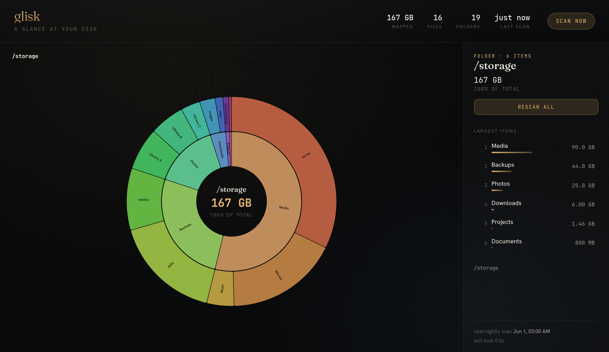

# glisk

> *glisk* — Scots for **a glance**, and **a gleam of light**.

A self-hosted, DaisyDisk-style **zoomable sunburst** of where your disk space
has gone. Point it at one or more directories; it walks them on a gentle
schedule and renders an interactive map you can dive into.

Go backend, React + d3 frontend, shipped as a single small container.



## Features

- **Zoomable sunburst** — click a wedge to dive in, click the centre to climb
  out, with a fluid "jelly" transition. Each top-level folder owns a hue and
  its descendants are tints of it.
- **Multiple volumes** — map several roots, each its own sunburst, with a path
  switcher. Their scans are serialised so they stay light on the host.
- **Gentle scanning** — the walk runs once overnight on a single low-priority
  thread and throttles itself; it is never continuous. You can also trigger a
  scan on demand from the UI.
- **Per-folder rescan** — re-walk just the folder you're looking at (handy
  while you clean one up) without waiting for a full scan.
- **Contents panel** — the ten largest items in the current folder, with bars.
- **Bounded + cached** — the tree is projected to a bounded shape (top-K
  children per directory, max depth, small entries folded away) and persisted,
  so the UI loads instantly and memory stays small.
- **Auth** — a single shared password gates the UI; `/health` and `/metrics`
  stay open for orchestration and Prometheus.

## Quick start

```yaml
# docker-compose.yml
services:
  glisk:
    image: ghcr.io/d0ugal/glisk:latest
    user: root            # needed to read across all files under the roots
    read_only: true
    ports:
      - "8080:8080"
    environment:
      GLISK_PASSWORD: "change-me"
      ROOTS: "/data/disk1,/data/disk2"   # one sunburst per path
    volumes:
      - /mnt/disk1:/data/disk1:ro
      - /mnt/disk2:/data/disk2:ro
      - ./cache:/cache
```

Then open `http://localhost:8080` and sign in.

## Configuration

All configuration is via environment variables.

| Var              | Default               | Meaning                                                        |
| ---------------- | --------------------- | -------------------------------------------------------------- |
| `GLISK_PASSWORD` | — (required)          | Web UI password. The server refuses to start without it.       |
| `ROOTS`          | —                     | Comma-separated paths, one sunburst each (id/label from the base name). |
| `CACHE_DIR`      | `/cache`              | Directory for per-volume `<id>.json.gz` caches.                |
| `SCAN_ROOT`      | `/data`               | Single-volume fallback when `ROOTS` is unset.                  |
| `DISPLAY_ROOT`   | = `SCAN_ROOT`         | Centre label in single-volume mode.                            |
| `CACHE_PATH`     | `/cache/tree.json.gz` | Single-volume cache file.                                       |
| `HTTP_ADDR`      | `:8080`               | Listen address.                                                |
| `SCAN_HOUR`      | `2`                   | Local hour-of-day for the nightly scan.                        |
| `EXCLUDE`        | `@*`                  | Comma-separated globs of directory base names to skip. The default drops Synology-style `@`-prefixed subvolumes whose reflinked contents over-report usage. |
| `TOP_K`          | `24`                  | Max children kept per directory in the projection.             |
| `MAX_DEPTH`      | `14`                  | Deepest level kept in the projection.                          |
| `MIN_FRACTION`   | `0.0001`              | Fold children smaller than this fraction of the total.         |
| `THROTTLE_EVERY` | `4000`                | Sleep after every N entries walked (0 disables).               |
| `THROTTLE_SLEEP` | `3ms`                 | How long to sleep when throttling.                             |

## HTTP endpoints

| Path                 | Method   | Purpose                                          |
| -------------------- | -------- | ------------------------------------------------ |
| `/`                  | GET      | The SPA (requires a session).                    |
| `/login`             | GET/POST | Sign-in page / form post.                        |
| `/api/volumes`       | GET      | List configured volumes (for the switcher).      |
| `/api/tree`          | GET      | `{status, tree}` for `?vol=<id>`.                |
| `/api/status`        | GET      | Scan status only (cheap; polled while scanning). |
| `/api/rescan`        | POST     | Queue a full scan of `?vol=<id>`.                |
| `/api/rescan-folder` | POST     | Re-walk one folder (`{"segments":[…]}`).         |
| `/metrics`           | GET      | Prometheus exposition, labelled per volume (open). |
| `/health`            | GET      | Liveness (open).                                 |

## Development

```sh
go test ./...            # backend tests
make lint                # golangci-lint (via Docker)

# Frontend dev server (proxies /api to VITE_API_TARGET, default localhost:8080)
cd internal/webui/frontend && npm install && npm run dev

# Full production image (multi-stage: npm build → go build → distroless-ish alpine)
docker build -t glisk:local .
```

## License

[MIT](LICENSE)
